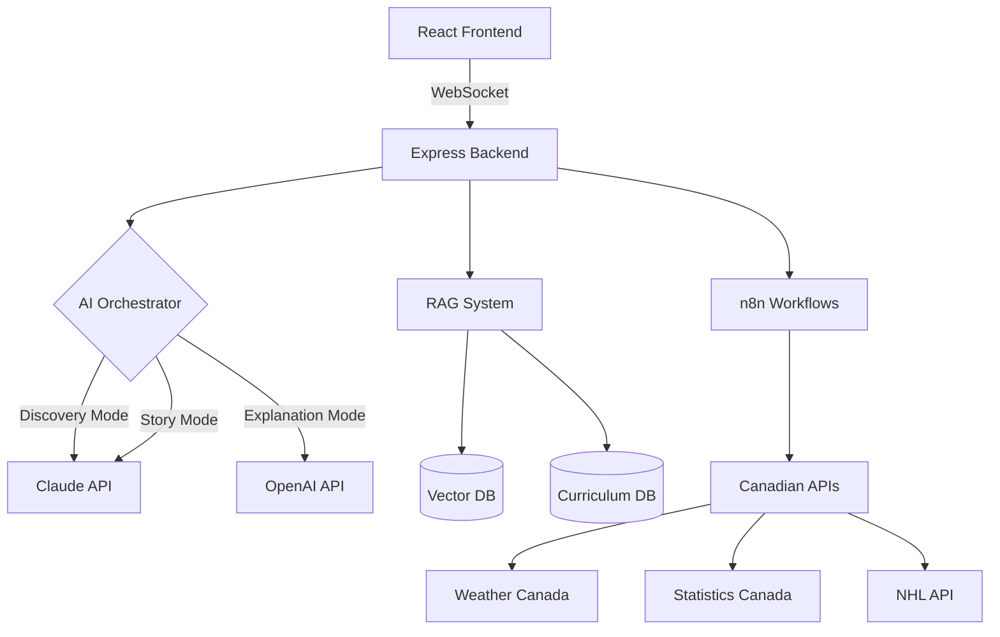

# 🍁 Maple - Ontario Grade 4 AI Tutor

> An intelligent, adaptive tutoring system that enhances young minds through discovery-based learning, storytelling, and real-time Canadian content.

[](https://choosealicense.com/licenses/mit/)
[](https://www.ontario.ca/curriculum)
[](https://github.com/stewmckendry/ai_tutor/issues)

## 🎯 Vision

**Transform how Grade 4 students learn** by creating an AI tutor that doesn't just provide answers, but cultivates intellectual curiosity, critical thinking, and a love of learning through Canadian-contextualized education.

### The Problem We're Solving
- **Brain Rot**: Traditional AI tools create passive learners who copy-paste without understanding
- **Disengagement**: Generic educational content doesn't connect with Canadian students' daily lives
- **One-Size-Fits-All**: Current tutoring systems don't adapt to individual learning styles
- **Lost Curiosity**: Direct answers kill the joy of discovery and exploration

### Our Solution
An AI tutor that:
- **Guides discovery** through Socratic questioning rather than giving answers
- **Tells stories** that make abstract concepts memorable and engaging
- **Uses real Canadian data** to make learning relevant (today's weather, hockey scores, local news)
- **Adapts intelligently** between exploration mode (Claude) and explanation mode (OpenAI)

## 👥 User Experience

### Meet Emma - Our Primary User
Emma is a 9-year-old Grade 4 student in Toronto. She's curious but sometimes struggles with abstract concepts. She loves hockey, reads at grade level, and uses an iPad for homework.

### Emma's Learning Journey

#### 1. First Contact
```
Emma: "Hi! I need help with light and sound for science"
Maple: "Hi Emma! I'm Maple 🍁, your learning buddy! Light and sound are everywhere around us. 
        Can you find 3 things in your room right now that make light?"
Emma: "My lamp, my iPad, and... the window?"
Maple: "Great observation! Now here's something interesting - which one of those MAKES light, 
        and which one just LETS light through? 🤔"
```

#### 2. Discovery Through Questions
- Maple never says "The answer is..."
- Instead: "What do you think would happen if...?"
- Celebrates thinking: "I love how you're thinking about this!"
- Provides hints: "Remember when we talked about how sound travels?"

#### 3. Story-Enhanced Learning
```
Maple: "Let me tell you about Alex, a young hockey player in Winnipeg who discovered something 
        amazing about sound at the rink. One day, Alex noticed the puck made different sounds 
        on different parts of the ice..."
```

#### 4. Real-World Connections
```
Maple: "Speaking of temperature and sound, did you know it's -15°C in Edmonton today and +2°C 
        in Vancouver? Sound actually travels differently in cold air! Want to explore why?"
```

### Parent Experience
- Daily summary emails of learning progress
- Insights into child's interests and struggles
- Curriculum alignment reports
- No account required (MVP)

### Teacher Integration (Future)
- Classroom assignment alignment
- Progress tracking across students
- Curriculum coverage reports
- Export for report cards

## ✨ Core Features

### 🧠 Phase 1: Intelligent Tutoring Core
- **Dual AI System**: Claude for discovery, OpenAI for explanations
- **Curriculum Alignment**: Ontario Grade 4 Science, Math, Language Arts
- **Adaptive Responses**: Adjusts complexity based on student performance
- **TODO Markers**: Interactive checkpoints for student work
- **Canadian Context**: Metric units, Canadian examples, local references

### 🎭 Phase 2: Storytelling Enhancement
- **Narrative Learning**: Curriculum concepts through Canadian adventure stories
- **Character Library**: Diverse Canadian characters as learning companions
- **Interactive Stories**: Students help characters solve curriculum-aligned problems
- **Story Continuity**: Multi-session narratives that build on previous learning
- **Reflection Prompts**: "What did Alex learn?" connects story to concept

### 🍁 Phase 3: Dynamic Canadian Content
- **Real-Time Data Integration**: Weather, sports, news for daily problems
- **n8n Workflows**: Automated content generation pipeline
- **Fresh Daily Content**: 100+ new problems generated automatically
- **Cultural Events**: Tied to Canadian holidays, events, seasons
- **Local Relevance**: Uses student's province/city for examples

## 🏗️ Technical Architecture

### System Overview


### Technology Stack

#### Frontend
- **Framework**: React 18 with TypeScript
- **Styling**: Tailwind CSS
- **State Management**: React Context + hooks
- **Real-time**: WebSocket for chat
- **Storage**: localStorage for sessions

#### Backend
- **Runtime**: Node.js with Express
- **Language**: TypeScript
- **APIs**: RESTful + WebSocket
- **Session**: Redis
- **Rate Limiting**: express-rate-limit

#### AI Integration
- **Claude**: Learning mode, storytelling, Socratic method
- **OpenAI**: Study mode, detailed explanations, complex topics
- **Orchestration**: Context-aware mode selection
- **Safety**: Content filtering, age-appropriate responses

#### Data Layer
- **Vector DB**: Pinecone/Weaviate for curriculum content
- **PostgreSQL**: Session data, analytics
- **Redis**: Caching, rate limiting
- **n8n**: Workflow automation

### Deployment Architecture
```
Production:
├── Frontend: Vercel/Netlify
├── Backend: Railway/Render
├── Database: Supabase/Neon
├── Vector DB: Pinecone Cloud
├── Workflows: n8n Cloud
└── Monitoring: Sentry
```

## 📊 Success Criteria

### 🎯 Educational Success
- [ ] Students generate 3+ original questions per session
- [ ] 70% prefer story mode over direct instruction
- [ ] Concepts retained 40% better with narrative context
- [ ] Reading level appropriate for 95% of Grade 4 students

### 💻 Technical Success
- [ ] Response time < 2 seconds for 95% of interactions
- [ ] 99.9% uptime during school hours (8am-8pm EST)
- [ ] Mobile responsive score > 95/100
- [ ] Accessibility WCAG 2.1 AA compliant

### 📈 Engagement Success
- [ ] Average session duration > 15 minutes
- [ ] Return rate > 60% within 7 days
- [ ] TODO completion rate > 70%
- [ ] Parent satisfaction > 4.5/5 stars

### 🍁 Canadian Impact
- [ ] 80% of examples use Canadian context
- [ ] Real-time data used in 50% of problems
- [ ] Covers 100% of Ontario Grade 4 curriculum expectations
- [ ] Positive cultural identity reinforcement

## 🚀 Getting Started

### Prerequisites
```bash
# Required
Node.js 18+
npm or yarn
Git

# API Keys needed
CLAUDE_API_KEY
OPENAI_API_KEY
PINECONE_API_KEY (or other vector DB)
```

### Local Development
```bash
# Clone the repository
git clone https://github.com/stewmckendry/ai_tutor.git
cd ai_tutor

# Install dependencies
npm install

# Set up environment variables
cp .env.example .env
# Edit .env with your API keys

# Start development servers
npm run dev

# Frontend: http://localhost:3000
# Backend: http://localhost:3001
```

### Using Git Worktrees (Parallel Development)
```bash
# Set up worktrees for parallel work
git worktree add -b issue-1a-frontend ../ai_tutor_worktrees/frontend
git worktree add -b issue-1b-backend ../ai_tutor_worktrees/backend
git worktree add -b issue-1c-content ../ai_tutor_worktrees/content
git worktree add -b issue-1d-integration ../ai_tutor_worktrees/integration

# Work in specific worktree
cd ../ai_tutor_worktrees/frontend
npm install
npm run dev
```

## 📚 Documentation

- [Claude Code Guide](./CLAUDE.md) - Implementation guide for Claude Code sessions
- [API Documentation](./docs/api.md) - Backend API reference
- [Component Library](./docs/components.md) - Frontend component documentation
- [Curriculum Alignment](./docs/curriculum.md) - Ontario curriculum mapping
- [AI Orchestration](./docs/ai-orchestration.md) - AI mode selection logic
- [Safety Guidelines](./docs/safety.md) - Content moderation and child safety

## 🗺️ Roadmap

### ✅ Phase 0: Setup (Complete)
- [x] Repository creation
- [x] Issue tracking setup
- [x] Development environment
- [x] Documentation framework

### 🚧 Phase 1: Core MVP (In Progress - Weeks 1-2)
- [ ] Basic chat interface
- [ ] AI orchestration (Claude + OpenAI)
- [ ] Light & Sound curriculum content
- [ ] Session persistence
- [ ] Mobile responsive design
- [ ] Basic safety filters

### 📅 Phase 2: Storytelling (Week 3)
- [ ] Story mode implementation
- [ ] Canadian character library
- [ ] Narrative templates
- [ ] Story progress tracking
- [ ] Parent summaries

### 📅 Phase 3: Dynamic Content (Weeks 4-5)
- [ ] n8n workflow setup
- [ ] Canadian API integrations
- [ ] Daily content generation
- [ ] A/B testing framework
- [ ] Content quality scoring

### 🔮 Future Enhancements
- [ ] User accounts and authentication
- [ ] Teacher dashboard
- [ ] Progress analytics
- [ ] More curriculum subjects
- [ ] French language support
- [ ] Indigenous perspectives integration
- [ ] Gamification elements
- [ ] Voice interaction
- [ ] AR/VR experiences

## 🤝 Contributing

We welcome contributions! Please see our [Contributing Guide](./CONTRIBUTING.md) for details.

### Development Process
1. Pick an issue from our [project board](https://github.com/stewmckendry/ai_tutor/issues)
2. Create a branch for your work
3. Make your changes with clear commits
4. Submit a PR with description
5. Wait for review and feedback

### Code Standards
- TypeScript for type safety
- ESLint for code quality
- Prettier for formatting
- Jest for testing
- Conventional commits

## 📄 License

This project is licensed under the MIT License - see the [LICENSE](LICENSE) file for details.

## 🙏 Acknowledgments

- **Ontario Ministry of Education** for curriculum documents
- **Anthropic** for Claude API and educational AI guidance
- **OpenAI** for GPT API and study mode capabilities
- **Canadian educators** who provided feedback and insights
- **Grade 4 students** who will test and improve the system

## 📞 Contact

- **Project Lead**: Stew McKendry
- **GitHub**: [@stewmckendry](https://github.com/stewmckendry)
- **Issues**: [GitHub Issues](https://github.com/stewmckendry/ai_tutor/issues)

## 🏆 Project Status

🚧 **Active Development** - We're currently building the MVP with target launch in 2 weeks.

Follow our progress:
- [Epic #1: Core MVP](https://github.com/stewmckendry/ai_tutor/issues/1) - In Progress
- [Epic #2: Storytelling](https://github.com/stewmckendry/ai_tutor/issues/2) - Planned
- [Epic #3: Dynamic Content](https://github.com/stewmckendry/ai_tutor/issues/3) - Planned

---

<div align="center">
  
**Built with ❤️ for Canadian Students**

*Making learning an adventure, one question at a time* 🍁

</div>
