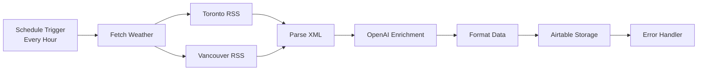

# n8n Content Pipeline Documentation

## Overview
This document describes the n8n workflow that fetches Canadian weather data, enriches it with OpenAI to create Grade 4 educational content, and stores it in Airtable.

## Architecture



## Prerequisites

- Docker and Docker Compose installed
- OpenAI API key with GPT-3.5 access
- Airtable Personal Access Token with write permissions
- Existing Airtable base ID

## Installation

### 1. Start n8n with Docker

```bash
cd n8n
./setup.sh
```

This will:
- Create necessary directories
- Start n8n container on port 5678
- Set up with basic authentication

### 2. Access n8n Interface

Open browser and navigate to:
- URL: `http://localhost:5678`
- Username: `admin`
- Password: `maple_tutor_2024`

### 3. Configure Credentials

#### OpenAI Credentials
1. In n8n, go to **Credentials** → **New**
2. Search for "OpenAI"
3. Name it: `OpenAI API`
4. Add your API key
5. Save

#### Airtable Credentials
1. In n8n, go to **Credentials** → **New**
2. Search for "Airtable"
3. Select "Airtable API Token"
4. Name it: `Airtable API`
5. Add your Personal Access Token
6. Save

### 4. Import Workflow

1. In n8n, click **Workflows** → **New**
2. Click menu (three dots) → **Import from File**
3. Select `workflows/weather_to_education_poc.json`
4. Review imported workflow

### 5. Configure Workflow

1. **Update Airtable Node**:
   - Click on "Save to Airtable" node
   - Set Base ID (or select from dropdown)
   - Verify table name is "Dynamic_Content_Test"

2. **Test Manual Execution**:
   - Click "Execute Workflow" button
   - Check each node for green checkmark
   - Verify data appears in Airtable

3. **Enable Schedule**:
   - Click on "Every Hour" trigger node
   - Toggle "Disabled" to enabled
   - Save workflow

## Workflow Components

### 1. Triggers
- **Manual Trigger**: For testing
- **Schedule Trigger**: Runs every hour (disabled by default)

### 2. Weather Fetching
Fetches RSS feeds from Environment Canada:
- Toronto: `https://weather.gc.ca/rss/city/ON-143_e.xml`
- Vancouver: `https://weather.gc.ca/rss/city/BC-74_e.xml`

### 3. XML Parsing
JavaScript code node extracts:
- Temperature (°C)
- Weather condition
- Humidity (if available)
- Wind (if available)
- Timestamp

### 4. OpenAI Enrichment
Sends structured prompt to GPT-3.5-turbo:
- System: Ontario Grade 4 teacher persona
- User: Weather data with specific output format
- Temperature: 0.7 for creativity
- Max tokens: 500

### 5. Data Formatting
Prepares data for Airtable:
- Parses AI response JSON
- Maps to Airtable fields
- Adds metadata (version, timestamp)

### 6. Airtable Storage
Creates record with fields:
- location
- temperature
- condition
- raw_weather (JSON)
- enriched_content
- science_connection
- activity_suggestion
- fun_fact
- vocabulary_word
- workflow_version
- pipeline_timestamp

### 7. Error Handling
- Logs errors with details
- Continues workflow on failure
- Returns status for monitoring

## Monitoring

### Execution History
View in n8n:
1. Go to **Executions** tab
2. Filter by:
   - Status (Success/Error)
   - Workflow name
   - Date range

### Metrics to Track
- Success rate (target: >90%)
- Average execution time (target: <30s)
- OpenAI token usage
- Error patterns

### Common Issues

| Issue | Solution |
|-------|----------|
| Weather fetch fails | Check RSS feed URLs are accessible |
| OpenAI timeout | Increase timeout in node settings |
| Airtable permission error | Verify token has write access |
| JSON parse error | Check OpenAI response format |
| Rate limiting | Add delay between executions |

## Testing Procedure

### Initial Test
1. Disable schedule trigger
2. Run manual execution
3. Check each node output
4. Verify Airtable record created

### Load Test
1. Run workflow 10 times manually
2. Check success rate
3. Monitor execution times
4. Review error logs

### 24-Hour Test
1. Enable schedule trigger
2. Let run for 24 hours
3. Collect metrics:
   - Total executions: 24
   - Successful: Target 22+
   - Average time: <30s
   - Data quality check

## Data Quality Checks

### Required Fields
All records must have:
- location (Toronto or Vancouver)
- temperature (numeric)
- enriched_content (non-empty)
- workflow_version

### Content Validation
Educational content should:
- Be 2-3 sentences
- Use Grade 4 vocabulary
- Include Canadian spelling
- Reference science concepts

### Sample Output
```json
{
  "location": "Toronto",
  "temperature": 5,
  "condition": "Partly Cloudy",
  "enriched_content": "It's 5°C in Toronto - that's like the temperature inside your fridge! The partly cloudy sky acts like a blanket, keeping some of the Earth's heat from escaping to space.",
  "science_connection": "Clouds reflect sunlight during the day and trap heat at night, showing how light and heat interact with matter.",
  "activity_suggestion": "Put a thermometer in the sun and shade - measure the temperature difference to see how clouds affect heat!",
  "fun_fact": "Toronto's CN Tower gets struck by lightning about 75 times per year!",
  "vocabulary_word": "Temperature: a measure of how much heat energy something has"
}
```

## Troubleshooting

### Docker Issues
```bash
# View logs
docker-compose logs -f

# Restart container
docker-compose restart

# Stop and remove
docker-compose down

# Clean restart
docker-compose down -v
docker-compose up -d
```

### Credential Issues
- Verify API keys are active
- Check rate limits not exceeded
- Ensure proper permissions

### Workflow Issues
- Check node connections
- Verify data mappings
- Review error messages in execution

## Cost Estimation

### OpenAI Usage
- Per execution: ~500 tokens
- Cost per execution: ~$0.001
- Hourly cost: $0.001
- Daily cost: $0.024
- Monthly cost: ~$0.72

### Airtable Usage
- Free tier: 1,200 records/base
- POC usage: 24 records/day
- Monthly: ~720 records (within free tier)

## Next Steps

After successful POC:

1. **Expand Data Sources**
   - Add more Canadian cities
   - Include sports scores
   - Add news headlines

2. **Enhance Enrichment**
   - Use GPT-4 for complex topics
   - Add curriculum alignment tags
   - Generate multiple content types

3. **Improve Pipeline**
   - Add caching layer
   - Implement retry logic
   - Add data validation

4. **Scale Infrastructure**
   - Move to n8n cloud
   - Set up monitoring dashboard
   - Implement alerting

## Lessons Learned

(To be completed after 24-hour test)

- [ ] Performance insights
- [ ] Error patterns
- [ ] Content quality assessment
- [ ] Infrastructure requirements
- [ ] Cost optimization opportunities

## Resources

- [n8n Documentation](https://docs.n8n.io)
- [Environment Canada RSS](https://weather.gc.ca/business/index_e.html)
- [OpenAI API Docs](https://platform.openai.com/docs)
- [Airtable API](https://airtable.com/developers/web/api/introduction)

## Support

For issues or questions:
1. Check execution logs in n8n
2. Review this documentation
3. Check Docker container logs
4. Verify API credentials and limits